# Caso-2-G1
Documentación de la UI del Caso #2

# Documentación de Resultados

## Proceso

El test de usabilidad se llevó a cabo utilizando la plataforma Maze, donde se importó el proyecto desde Figma para facilitar el análisis de la experiencia de usuario. Se compartió un enlace con varios sujetos para realizar una serie de “misiones”. Estas misiones se completan de manera satisfactoria si el usuario sigue el camino correcto definido por los diseñadores. Maze también permite realizar un análisis gráfico de los clics del usuario, ayudando a identificar posibles errores de usabilidad y proporcionando datos cuantitativos útiles para futuras decisiones, con el fin de crear un programa fácil de usar y garantizar una óptima experiencia de usuario.

## Sujetos de Prueba

Las siguientes tareas o misiones se realizaron a una muestra de 9 usuarios de distintas edades, de los cuales la mayoría rondaban entre los 19 y 22 años, tal como se muestra a continuación.

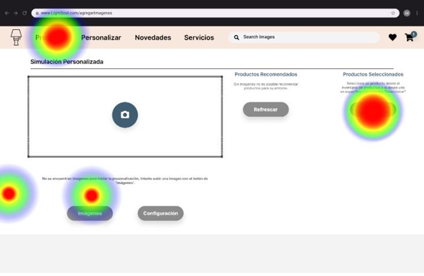

## Resultados Obtenidos

### Task 1: Seleccionar un producto cualquiera

En la pantalla inicial de esta tarea gran parte de los usuarios seleccionaron un camino erróneo o incorrecto al que se debía tomar, en este caso se tenía que presionar el botón de seleccionar ubicado a la derecha debajo de “Productos Seleccionados”, sin embargo, muchos optaron por presionar la opción de “Productos” en el encabezado de la pantalla, tal como se muestra con el mapa de calor de la siguiente imagen.

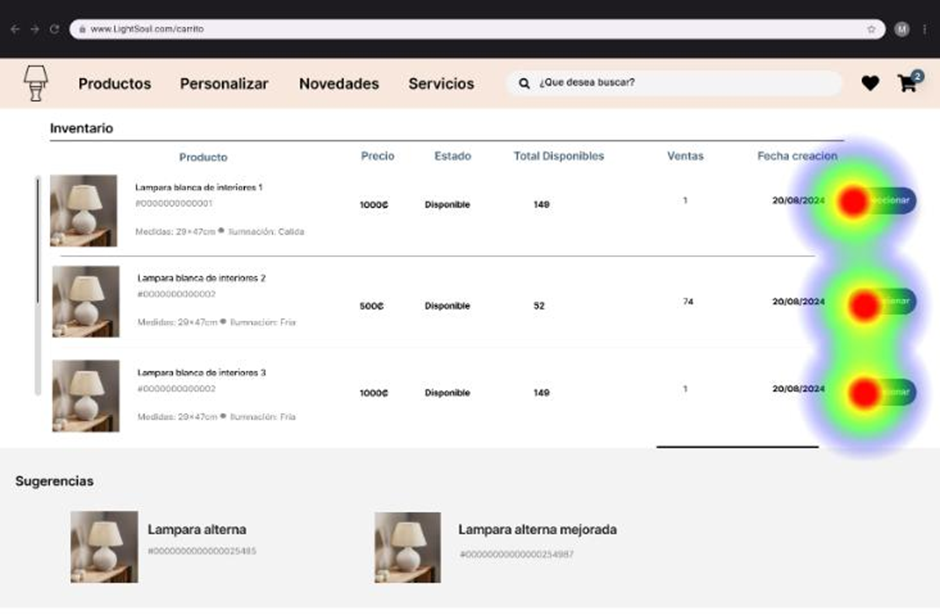

Es curioso que en la pantalla siguiente varios optaron por seleccionar un producto distinto, algunos seleccionaron el primero, mientras que otros el segundo y tercero, pero al final todos lograron cumplir el objetivo de forma directa y sin complicaciones, tal como se observa en la siguiente imagen

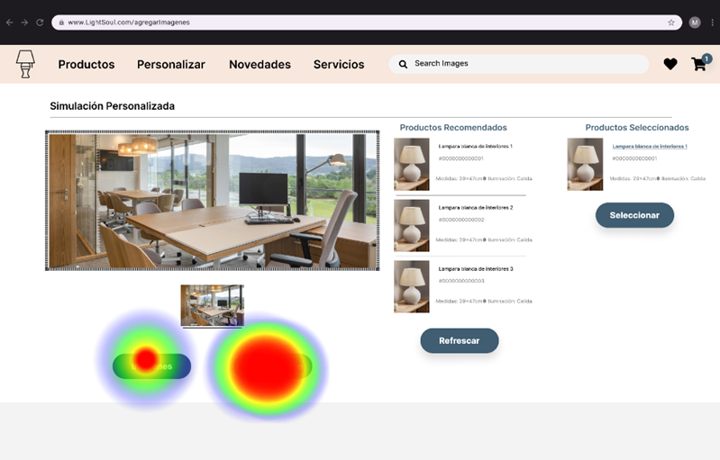

#### Análisis General
La tarea fue realizada por 9 usuarios, de los cuales el 55.6% realizó el camino de forma directa, mientras que el 22.2% no completó la tarea. Un 40.5% presionó algún botón incorrecto, y el tiempo promedio para completar la tarea fue de 23.4 segundos. Se concluye que la tarea podría mejorarse para mayor claridad y facilidad.

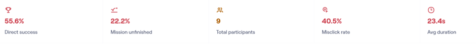

### Task 2: Configurar la simulación para modo noche y guardar los cambios

En la pantalla inicial se puede apreciar que se utilizó mayormente el botón de “Configurar” y muy pocos usuarios seleccionaron el botón de “Imágenes”, no se 
seleccionó el botón de “Refrescar” ni el de “Seleccionar”. Se genera un impulso principalmente de configurar de manera personalizada.

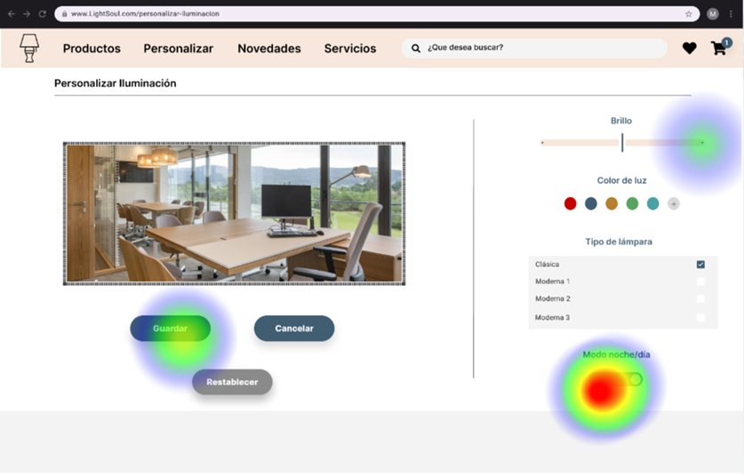

En la siguiente ventana, se hizo un correcto uso del modo nocturno, a pesar de que la idea principal era de cambiar modo noche y modo día, los usuarios también intentaron realizar un aumento de brillo a las lámparas y además, se intentó guardar los cambios.

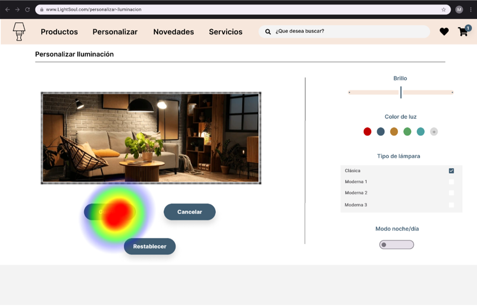

En la siguiente ventana se tiene como objetivo guardar los cambios, como se puede apreciar que la prueba fué exitosa y se dió a entender la funcionalidad de la misma ya que el único botón seleccionado fué el de “Guardar”.

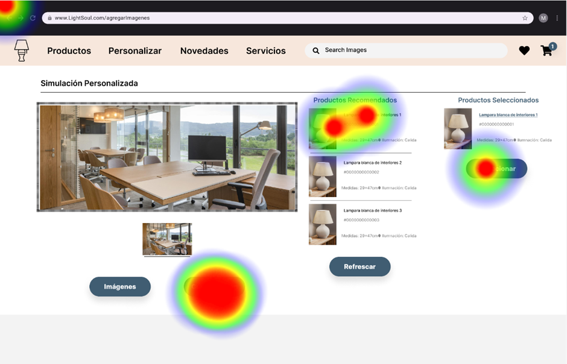

#### Análisis General
En la tarea número 2 se puede observar que un 33.3% de los usuarios lograron completar la misión de forma directa, un 44.4% de los usuarios no lograron finalizar la tarea. A su vez, se registró una tasa de clics erróneos del 60%, destacando una interfaz confusa para el usuario. El tiempo promedio para completar la tarea fue de 24.3 segundos. Estos resultados indican que la tarea podría beneficiarse de mejoras en su diseño para ser más intuitiva y facilitar un recorrido más claro y directo para los usuarios, reduciendo la posibilidad de errores y aumentando la tasa de éxito.

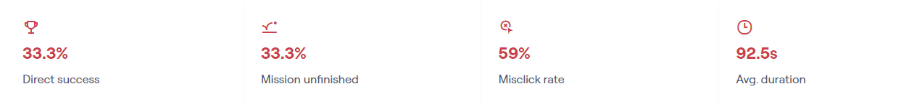

### Task 3: Configurar el tipo de lámpara a "Moderna 1" y guardar los cambios

Inicialmente, observamos que en la pantalla principal de la simulación se acata correctamente la instrucción de seleccionar el botón “configuración” en la mayoría de los casos, sin embargo, también se suele seleccionar el botón que funciona para “tomar” un producto de la simulación e incluso algunos usuarios intentan seleccionar un producto recomendado. Estos dos comportamientos no son correctos, pero representan la minoría de los casos.

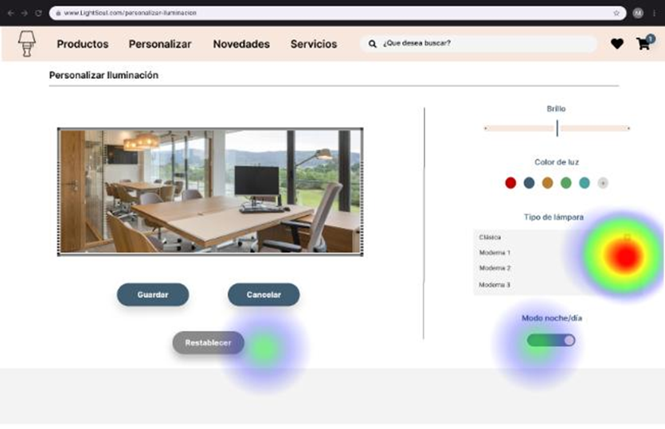

Una vez dentro de la pestaña de personalización, el comportamiento corresponde al esperado, ya que casi todos seleccionaron satisfactoriamente el tipo de lámpara solicitado.

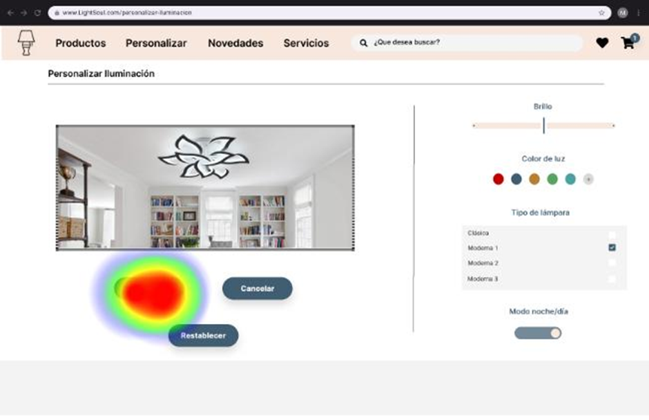

Finalmente, los usuarios interpretan correctamente el flujo lógico del diseño y seleccionan el botón “guardar” para que los cambios se apliquen y mantengan satisfactoriamente en la simulación.

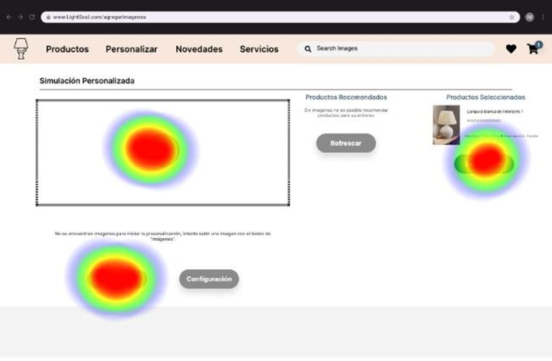

#### Análisis General
Esta tarea registró que un 55.6% de los usuarios completaron la misión de forma directa, un 11.1% no lograron finalizar la tarea y se obtuvo una tasa de clics erróneos del 36.9%, lo que indica que una proporción significativa de usuarios presionó algún botón u opción incorrecta durante el proceso. Por último, el tiempo promedio para completar la tarea fue de 17.6 segundos. A partir de estos resultados, podemos inferir que, aunque la mayoría de los usuarios completó la tarea con éxito, aún existe margen de mejora para reducir los errores y hacer la tarea más accesible e intuitiva para todos los usuarios. 

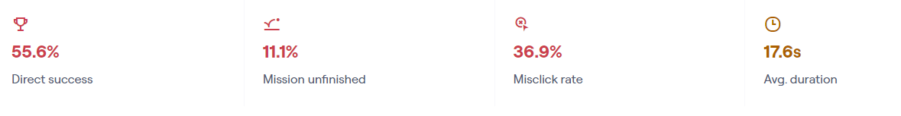

### Task 4: Agregar 3 imágenes y guardar los cambios

El primer mapa de calor respecto al inicio de esta actividad nos muestra una clara tendencia de los usuarios, que interpretan que el ícono central con forma de cámara tiene la función de añadir imágenes, cuando realmente representa el espacio donde se va a generar la imagen simulada mediante AI. Se puede observar cómo los usuarios clican ambas zonas casi la misma cantidad de veces, mientras que en tercer lugar se posiciona el botón “seleccionar”, el cuál corresponde a la opción de seleccionar un producto y esto no tiene ninguna relación con la solicitud de “agregue 3 imágenes”. 

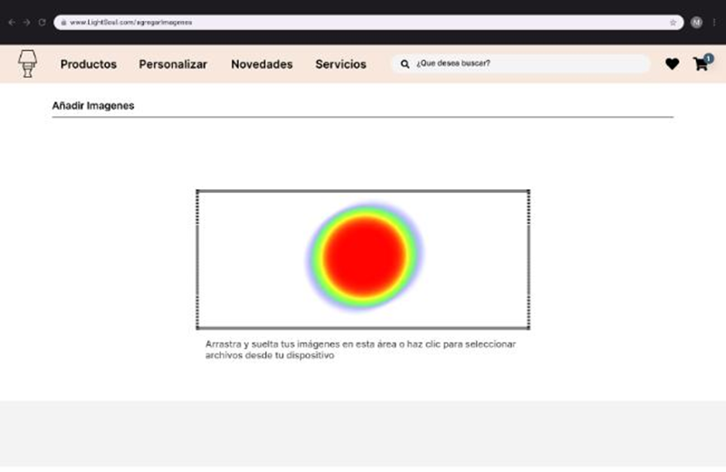

En la segunda pantalla se presenta el resultado esperado, pues, es una pantalla con pocos elementos interactuables y un texto que ayuda a orientar al usuario.

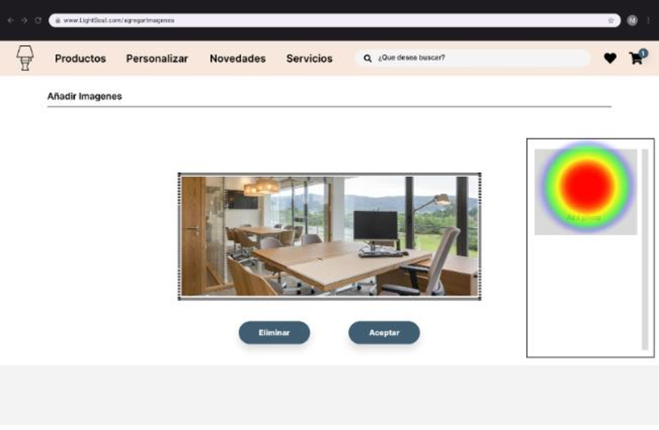

Finalmente, observamos un comportamiento esperado en la última pantalla, donde los usuarios seleccionan correctamente el botón “add photo” y esto les permite cumplir con la misión asignada.

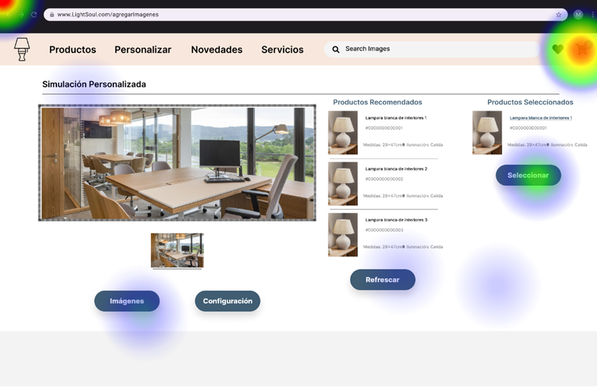

#### Análisis General
En la tarea 4 se obtuvo que un 33.3% de los 9 usuarios lograron completarla de forma directa y un 33.3% no pudieron finalizar la tarea. Por otro lado, se registró una alta tasa de clics erróneos del 59%y un tiempo promedio para completar la tarea de 92.5 segundos. Estos resultados indican que la tarea es considerablemente desafiante y que probablemente requiere ajustes significativos para mejorar la claridad, reducir la tasa de errores y permitir que los usuarios la completen de manera más eficiente y sin confusión. 

### Task 5: Añadir el producto seleccionado al carrito

En esta misión se le solicita al usuario que añada un producto al carrito y la mayoría optó por consultar el carrito, seleccionando el ícono superior derecho. Este comportamiento no era el esperado, ya que se esperaba que los usuarios seleccionaran el ícono de carrito que se encuentra al lado de cada producto, no al que está en el panel. 

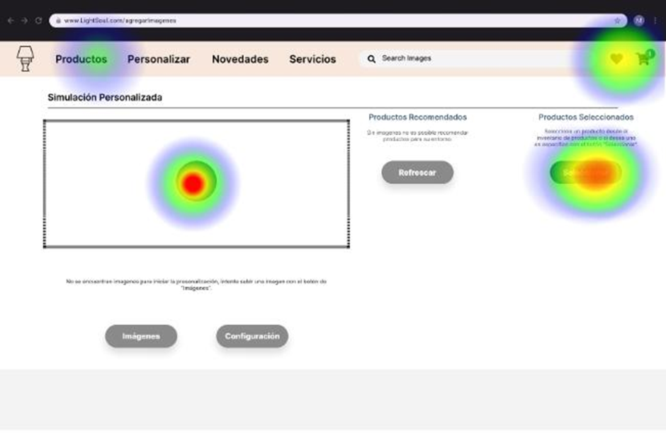

#### Análisis General
Esta tarea en sus pruebas obtuvo que un 66.7% de los usuarios logró completarla de manera directa y un 22.2% de los usuarios no logró finalizar la tarea. Además, se observó una elevada tasa de clics erróneos del 75.8% y un tiempo promedio para completar la tarea de 18.7 segundos. Estos resultados indican que, aunque la mayoría de los usuarios pudo completar la tarea, el alto porcentaje de errores indica que es necesario mejorar la claridad y el diseño de la tarea para reducir la confusión y facilitar un flujo más fluido y preciso para los usuarios. 

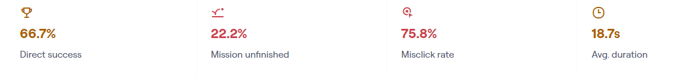

### Task 6: Añadir el producto "Lámpara blanca de interiores 1" a favoritos

En esta tarea el usuario debía presionar la opción de “Productos” del encabezado, sin embargo, la mayoría presionó otras opciones, tal como “seleccionar” un producto, la imagen de la cámara o bien el corazón en la esquina superior derecha. Gracias al mapa de calor podemos observar que una pequeña parte de los usuarios terminaron presionando la opción de productos, los demás presionaron todas las demás opciones y seguramente terminaron la tarea sin completarla. 

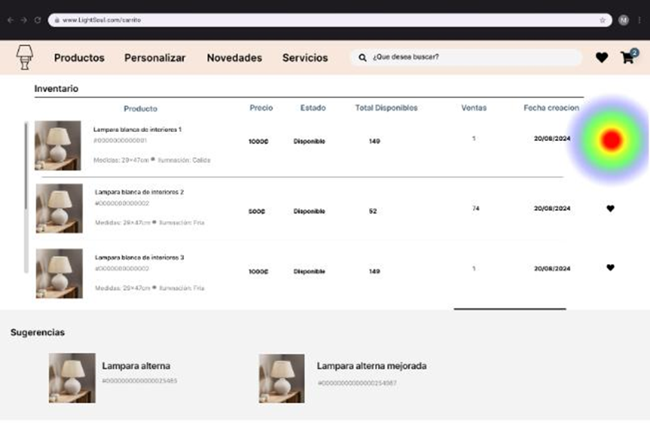

En esta pantalla se muestra un adecuado comportamiento por parte de los usuarios, ya que todos presionaron la opción correcta que en este caso era el corazón al lado del producto “lámpara blanca de interiores 1”, ninguno tuvo algún problema al encontrar la solución. 

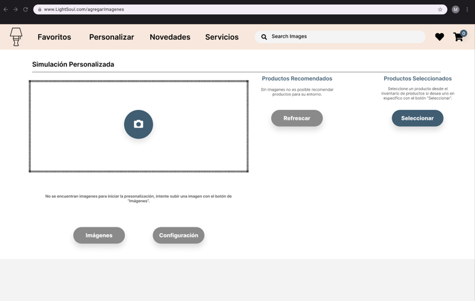

#### Análisis General
Finalmente, la tarea número 6 se registró que un 11.1% de los 9 usuarios logró completarla de manera directa y un 44.4% no logró finalizar la tarea. A su vez, se observó una alta tasa de clics erróneos del 84% y un tiempo promedio bastante elevado para completar la tarea, que fue de 199.8 segundos. Estos resultados indican que la tarea es considerablemente compleja y poco intuitiva, lo que probablemente generó confusión y dificultades para los usuarios. Es necesario realizar ajustes significativos en el diseño de la tarea para mejorar la claridad y facilitar su finalización de manera más rápida y sin errores. 

## Correcciones

1. Dados los resultados obtenidos pudimos observar que casi todos los usuarios tuvieron problemas con la tarea de agregar un producto a favoritos, y gracias al mapa de calor nos dimos cuenta que esto se debía a que las personas pasan por desapercibido la opción de “productos” ubicada en el encabezado, todos clickeaban el botón de “seleccionar” de productos seleccionados o bien el corazón ubicado en la esquina superior derecha. Para corregir este problema decidimos eliminar la opción de “Productos” y añadir la opción de “Favoritos”, con el fin de que sea más intuitivo para el usuario, tal como se observa en la siguiente imagen 

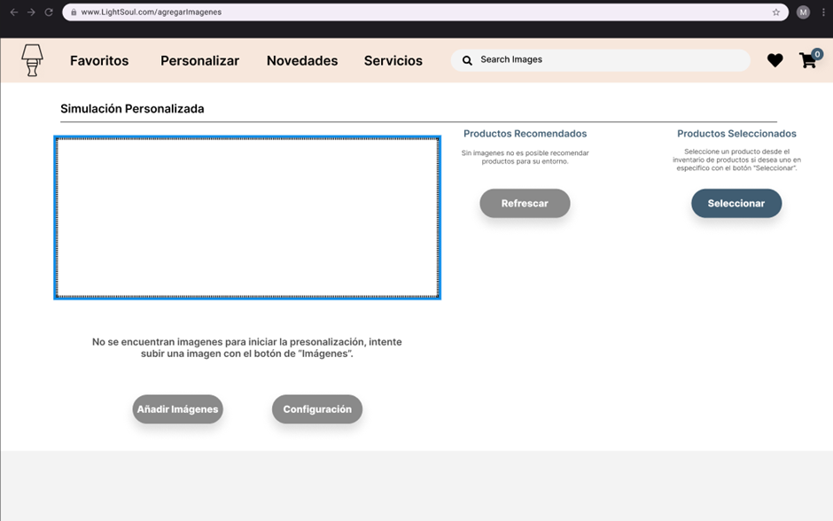

2. En la tarea de agregar una imagen logramos captar un problema que la mayor parte de los usuarios cometía producto de una mala representación gráfica, y es que en la pantalla main dentro del marco punteado se encuentra una imagen de una cámara pequeña, la cual pensamos en un principio que daría a entender al usuario que ahí iba la imagen personalizada por la IA, pero la realidad es que solo confundimos al usuario generando el pensamiento de que se tenía que presionar dicha cámara para añadir una imagen, además de que el texto que indica que se debe de presionar el botón “imagenes” es muy pequeño y pasa desapercibido por el usuario, por lo que decidimos eliminar dicha imagen, aumentar el tamaño del texto y cambiar el botón “imagenes” por “añadir imagenes” para mayor claridad, tal como se muestra en la imagen a continuación.

